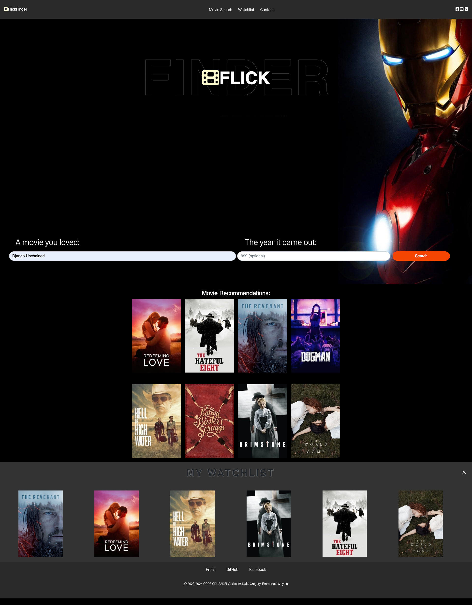

# Project name: FlickFinder

The aim of this project is to execute a design that solves a real-world problem by integrating data received from multiple server-side API requests. Also this project aims to bring developers to work collaboratively, using agile development methodologies and implement feature and bug fixes using git branch workflow and pull requests.

## Functionality

The Team has worked on a Movie recommendation APP, where a User can search for a movie by Title and/or Year of release to get related movies the user can watch. The full functionality of the APP is listed below:

* The user can search a Movie by Title and/or by Year of Release.
* The user will be presented will the search result of the movie they have searched for.
* The user can click on one of the search results to get recommendations of other movies in similar genres/categories.
* The user can click on any of the recommended movies to watch a trailer of the selected movie, which pops-up in a Modal.
* The user can decide to add the selected recommended movie to Watchlist.
* The user can click the IMDB Button in the Watchlist to take the user to the IMDB Website where the user can Rent or Buy the Movie.
* The user can clear the movies from the Watchlist on the click of a button.

## Tech Stack

The list of the Tech Stack used in developing the APP are below:

* Request to [TMDB API](https://developer.themoviedb.org/reference/intro/getting-started) to get Movie ID and Poster.
* Request to [WatchThis API](https://rapidapi.com/vitalsx-apis-vitalsx-apis-default/api/watchthis/) to get Movie recommendations.
* Request to [Google YouTube API](https://developers.google.com/youtube/v3/docs/search/list) to get the Movie Trailers.
* Bootstrap
* JQuery
* HTML5, CSS3 and JavaScript

## Collaborators

* [Dale Warburton](https://github.com/Dezmondo7)
* [Emmanuel Boadi](https://github.com/emmaboadi)
* [Gregory Oghenah](https://github.com/kenigreg)
* [Lydia Barham](https://github.com/lydiabarham)
* [Yasser Rezvani](https://github.com/yrezvani)

## Mock-Up

The following image shows the web application's appearance and functionality: 

## Presentation

The link to the presentation slides can be found [here]().

## Deployment

The application is deployed live at the following [Web Page]().
